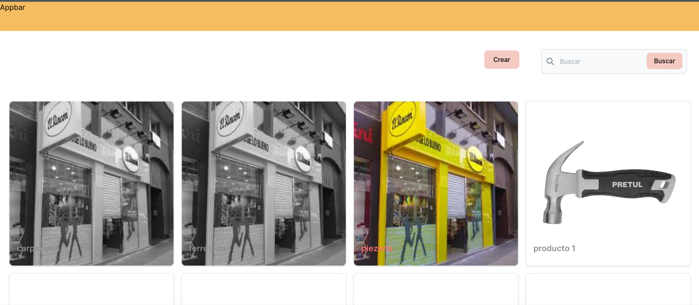

# NegociosCol Panel

**site: [negocioscol.com](https://negocioscol.vercel.app/)**

- [NegociosCol Panel](#negocioscol-panel)
  - [Requisitos de instalación](#requisitos-de-instalación)
  - [Instrucciones para la instalación](#instrucciones-para-la-instalación)
  - [MOCKUPS](#mockups)
  - [Testings](#testings)


## Requisitos de instalación

Asegúrate de tener instalado y configurado Docker antes de comenzar.

- [Docker](https://www.docker.com)

## Instrucciones para la instalación

1. Clonar el repositorio de la API en la máquina local:
   
   ```sh
   git clone https://github.com/LuisDeLaValie/api_negosioscol.git
   ```

2. Navegar al directorio del proyecto:
   
   ```sh
   cd api_negosioscol
   ```

3. Ejecutar el siguiente comando para iniciar los contenedores:

    ```sh
    docker-compose up -d
    ```

    > **IMPORTANTE**
    >
    > Debe estar iniciado el Docker engine para ejecutar el comando anterior,
    > si no lo está, se devolverá un mensaje de error indicando que no se
    > encontró el docker daemon.

4. La API estará disponible en `http://localhost:8081`.


5. Clonar el repositorio del panel en la máquina local:
   
   ```sh
   git clone https://github.com/LuisDeLaValie/negocioscol-panel.git
   ```

6. Navegar al directorio del proyecto:
   
   ```sh
   cd negocioscol-panel
   ```
7. Insertar las dependencia de la aplicación
   
   ```sh
   npm i
   ```
8. Renombrar el archivo `.env.example` a `.env.local` para agregar la variable de entorno. Asegurese de que  `NEXT_PUBLIC_PUBLIC_API_URL` tenga la ruta de la API
    > NOTA:
    > Este proyecto usa NEXTJS por lo que es importante que el `.env` tenga el nombre `.env.local` de lo contrario nextjs no reconocera los env
    >
    > para mas informacion ver [nextjs environment](https://nextjs.org/docs/app/building-your-application/configuring/environment-variables)

9. Ejecutar el panel
    ```sh
    npm run dev
    ```

## MOCKUPS

Los Mockups de la palicación los pueden enctonra en el siguinte [enlace](https://www.figma.com/proto/x4zipimXD1EeJsczwH9odn/Proyecto-Final?node-id=4-106&t=NpSxe7HKnYINoPG8-0&scaling=scale-down&page-id=0%3A1&starting-point-node-id=4%3A106) 

## Testings
para crear los TESTS utilizafmos la libreria `jest` para poder crar los TESTS. Para poder ejecutrlos usamos el siguinte comando
```sh
npm test
```